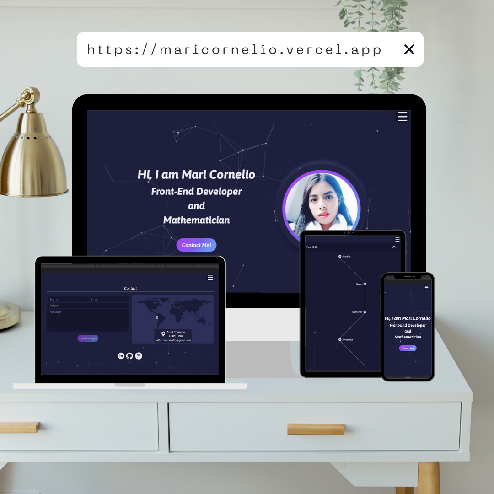

# Portfolio

## Índice

- [Resumen del proyecto](#1-resumen-del-proyecto)
- [Contenido](#2-contenido)
- [Tecnologías](#3-tecnologías)
- [Contribuciones](#4-contribuciones)
- [Contacto](#5-contacto)

## 1. Resumen del proyecto

¡Bienvenido(a) a mi portafolio personal! Este proyecto es una recopilación de mis habilidades, proyectos destacados con sus respectivas tecnologías utilizadas y la forma de contactarme. Aquí podrás conocerme mejor y explorar el trabajo que he realizado hasta la fecha.

## 2. Contenido

### Habilidades:

En esta sección, encontrarás información sobre las habilidades y competencias técnicas que poseo. Desde lenguajes de programación y tecnologías hasta conocimientos en diseño y otras áreas relevantes.

### Proyectos:

Aquí podrás explorar una selección de mis proyectos más destacados. Cada proyecto tiene una breve descripción (no dudes en usar los nombres de usuario y contraseña de algunos proyectos con inicio de sesión que mostraré en las descripciones para mayor interactividad con el proyecto), enlaces a su repositorio correspondiente (si es un proyecto de código abierto) y, en algunos casos, un enlace al proyecto en línea para que puedas verlo en acción.

### Contacto:

Si deseas colaborar, contactarme para proyectos futuros, tienes preguntas o simplemente quieres saludar, esta sección contiene los medios para contactarme. Ya sea a través de mi correo electrónico, redes sociales o cualquier otra forma de comunicación.

## 3. Tecnologías

En el desarrollo de este portafolio, he utilizado diversas tecnologías y herramientas para crear una experiencia atractiva y funcional. A continuación, se enumeran algunas de las principales tecnologías que he empleado:

- **Angular**: Como framework de desarrollo frontend, he utilizado Angular para crear una estructura sólida y componentes reutilizables que hacen que el portafolio sea altamente dinámico y eficiente.

- **Typescript**: He utilizado Typescript para añadir tipado estático a JavaScript, lo que mejora la legibilidad y mantenibilidad del código, así como para aprovechar características modernas de ECMAScript.

- **API Rest**: Para conectar con el servicio FormSubmit y obtener datos de manera dinámica, he utilizado APIs REST, lo que permite una interacción fluida con los datos y recursos necesarios para el portafolio.

- **CSS y HTML**: Estas tecnologías fundamentales han sido esenciales para dar forma al diseño del portafolio y crear una experiencia visual agradable y responsive para los visitantes.

- **AOS** (Animate On Scroll) y ParticleJS: Para agregar un toque de interactividad y atractivas animaciones, he incorporado estas librerias, lo que proporciona una experiencia de usuario más inmersiva y llamativa.

Estas son solo algunas de las tecnologías que he empleado en el desarrollo de este portafolio. Cada una de ellas ha sido seleccionada con el propósito de crear una plataforma atractiva y funcional que muestre mis habilidades como desarrollador.

Si deseas conocer más detalles sobre cómo se han implementado estas tecnologías, te invito a explorar el código fuente del proyecto en los respectivos repositorios.

## 4. Contribuciones

Siéntete libre de revisar mi portafolio, tomarlo como inspiración, proporcionar sugerencias, ideas o comentarios. ¡Toda retroalimentación es bienvenida! Si encuentras algún error o tienes alguna mejora en mente, puedes abrir un issue o enviar un pull request.

## 5. Contacto

- **e-mail**: katherinacornelio@gmail.com
- **LinkedIn**: https://www.linkedin.com/in/maricornelio/
- **Portfolio**: https://maricornelio.vercel.app/
